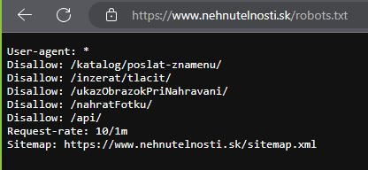

```{r setup, include=FALSE}
knitr::opts_chunk$set(echo = TRUE)
```

## Caution
<br>
Before I get to the topic of this post, please note that this article is for <strong>informational purposes only</strong> and that any information contained below <strong>does not constitute legal advice</strong>. Therefore, before engaging in any scraping activities, you should get appropriate professional legal advice regarding your specific situation.

## Web scraping
<br>
In this blog post I will go through <strong>[web scraping](https://en.wikipedia.org/wiki/Web_scraping)</strong> using <strong>R programming language</strong>.
Before I dive into the process itself I would like to talk a bit about the topic in general.
<br>
Web scraping is the process of collecting content or (usually) structured data from websites in an automated manner (and usually in large amount). This definition naturally brings up the question of legality of such a process.
In general, web scraping is not illegal or prohibited per se (in EU, as of July 2023) . However, the use of data mining tools is legally risky due to several reasons:

* Intellectual property breach
* Contract breach
* Privacy concerns

To minimize concerns, scraping should be discreet, respect websites’ terms of service, check whether sites are using the robots.txt protocol to communicate that scraping is prohibited, avoid personal data scraping and, if it is necessary, make sure no GDPR violations are made and avoid scraping private or classified information ([Source](https://discoverdigitallaw.com/is-web-scraping-legal-short-guide-on-scraping-under-the-eu-jurisdiction/#IV_HOW_TO_SCRAPE_AND_NOT_BE_SUED)).
<br>
There are some general ethic principles that you should follow when you want to scrape data from web.
The most frequently mentioned are:

* If there is a public <strong>[API](https://en.wikipedia.org/wiki/API)</strong> that provides the data you are looking for, use it instead of scraping.
* Request data at a reasonable rate. So your scraping is not being harmful on the server and can't be confused with a <strong>[DDoS attack](https://en.wikipedia.org/wiki/Denial-of-service_attack)</strong>. 
* Respect other's intellectual property. Use the data to create new value from the data, not to duplicate and pass it as your own or illegally sell it.
* Do not scrape personal or private data or documents, respect the GDPR.
* View robots.txt file to check how the site should be crawled.
* Share what you can. If the data you scraped is in the public domain or you got permission to share it, then put it out there for other people to reuse it (e.g. on [GitHub](github.com) or [Kaggle](kaggle.com)). If you wrote a web scraper to access it, share its code so that others can benefit from it.
* Look for ways how to return value to website you are scraping, e.g. reference the website in an article or post, so you drive traffic to it.

You can find several articles dealing with this topic e.g. [This one on towardsdatascience.com](https://towardsdatascience.com/ethics-in-web-scraping-b96b18136f01), or on [Data Fluency github page](https://monashdatafluency.github.io/python-web-scraping/section-5-legal-and-ethical-considerations/) or on [scrapingrobot page](https://scrapingrobot.com/blog/ethical-web-scraping/).
<br>
In this article I will scrape data from [Nehnutelnosti](https://www.nehnutelnosti.sk/) website that specializes in real estate listings and services. To follow ethical scraping principles, I made some preventive measures and actions: 

* This particular website uses robots.txt protocol. I am not scraping any part that is disallowed and in some parts of code I added _Sys.sleep()_ function to slow down the process so I request data at a reasonable rate.
* I scrape only public data I need and probably will limit this data even further after [EDA](https://en.wikipedia.org/wiki/Exploratory_data_analysis).
* I have publicly available [GitHub repo](https://github.com/Arnold-Kakas/real_estate_appraisal) where all code and data can be accessed.
<br>
<center>

</center>
<br>

## Scraping process {.tabset .tab-pills}
<br>
### Packages
<br>
As usual, I start with loading packages necessary for this project. I am using [packman](https://cran.r-project.org/web/packages/pacman/index.html) package and function _p_load()_ to do this. I has two advantages compared to traditional _library()_:

* if the library is not installed, it will do it automatically
* you can load multiple libraries at once

```{r cars, eval=FALSE, include=FALSE}
if (!require("pacman")) {
  install.packages("pacman")
}
pacman::p_load(
  rio,
  tidyverse,
  rvest, # scraping
  httr, # working with html
  RSelenium, # scraping in Google Chrome
  netstat, # free_port()
  doParallel, # parallel processing
  furrr # future map
)
```

There are three groups of packages in this project:

* for data loading and data wrangling - rio, tidyverse
* for web scraping - rvest, RSelenium, netstat, httr
* for parallel processing - doParallel and furrr


### Scraping part I.

```{r}
# apartments page
site <- "https://www.nehnutelnosti.sk/slovensko/byty/predaj/?p[param1][from]=1000&p[param1][to]=&p[page]="

# scrape the number of pages
number_of_pages <- read_html(paste0(site, 1)) %>%
  html_nodes(xpath = '//*[@id="content"]/div[8]/div/div/div[1]/div[17]/div/div/ul/li[5]') %>%
  html_elements("a") %>%
  html_text(trim = TRUE) %>%
  as.numeric()

# create a cluster of worker processes (cores)
plan(multisession, workers = 6)

advertisements <- future_map_dfr(1:number_of_pages, function(i) {
  page_content <- read_html(paste0(site, i))
  Sys.sleep(6) # wait 6 seconds
  price <- page_content %>%
    html_nodes(xpath = '//*[@class="advertisement-item--content__price col-auto pl-0 pl-md-3 pr-0 text-right mt-2 mt-md-0 align-self-end"]') %>%
    html_attr("data-adv-price")
  type_of_real_estate <- page_content %>%
    html_nodes(xpath = '//*[@class="advertisement-item--content__info"]') %>%
    html_text2()
  address <- page_content %>%
    html_nodes(xpath = '//*[@class="advertisement-item--content__info d-block text-truncate"]') %>%
    html_text2()
  link <- page_content %>%
    html_nodes(xpath = '//*[@class="mb-0 d-none d-md-block"]') %>%
    html_nodes("a") %>%
    html_attr("href")
  tibble(price = price, type_of_real_estate = type_of_real_estate, address = address, link = link)
})

# Delete all cookies from the last 24 hours
clearCookies <- function(remDr) {
  remDr$deleteAllCookies()
}

# Define a function that handles the errors in page load
navigate_with_retry <- function(link, remDr) {
  success <- FALSE
  while (!success) {
    tryCatch(
      {
        remDr$navigate(link)
        Sys.sleep(5)
        success <- TRUE
      },
      error = function(e) {
        cat("Failed to navigate to", link, "- Retrying in 10 seconds...\n")
        clearCookies(remDr)
        Sys.sleep(10)
      }
    )
  }
}

# Define a wrapper function that handles the errors in element search
safe_find_element <- possibly(function(page, xpath) {
  page$findElement(using = "xpath", xpath)
}, NA)

# function to get text or return NA if not found
get_text_or_na <- function(nodes) {
  tryCatch(
    {
      text <- nodes %>%
        html_text2() %>%
        as.character() # %>%
      # str_trim() %>%
      # str_squish()
      if (text == "") NA else text
    },
    error = function(e) {
      NA
    }
  )
}


# Additional info from web
################################################################################################
# number of splits
num_splits <- 10
split_size <- ceiling(nrow(advertisements) / num_splits)

# split the data frame into subsets
advertisments_list <- split(advertisements, rep(1:num_splits, each = split_size, length.out = nrow(advertisements)))

for (i in seq_along(advertisments_list)) {
  assign(paste0("advertisements_", i), advertisments_list[[i]])
}


################################################################################################
# create empty dataframeoutside of the loop to hold additional info
additional_info_df <- tibble(
  link = character(),
  info_text = character(),
  additional_characteristics = character(),
  index_of_living = character(),
  info_details = character(),
  stringsAsFactors = FALSE
)


for (i in 2:10) { #10, if ok, go to 2:10
  # get the current dataframe
  current_df <- get(paste0("advertisements_", i))

  # start the server
  rs_driver_object <- rsDriver(
    browser = "chrome",
    chromever = "113.0.5672.63",
    verbose = FALSE,
    port = free_port(random = TRUE)
  )

  # create a client object
  remDr <- rs_driver_object$client

  # open a browser
  remDr$open()
  remDr$maxWindowSize()
  #remDr$deleteAllCookies()
  
  # navigate to a website
  remDr$navigate("https://www.nehnutelnosti.sk/")
  Sys.sleep(5) # wait for 5 seconds

  # accept cookies
  remDr$switchToFrame(remDr$findElement(using = "xpath", '//*[@id="sp_message_iframe_710573"]'))
  remDr$findElement(using = "xpath", '//*[@id="notice"]/div[5]/div[2]/button')$clickElement()

  # loop through each link in the current dataframe
  for (link in current_df$link) {
    info_text <- NA
    additional_characteristics <- NA
    index_of_living <- NA
    info_details <- NA

    navigate_with_retry(link, remDr)
    #remDr$executeScript("document.body.style.zoom = '50%';")
    height <- as.numeric(remDr$executeScript("return document.documentElement.scrollHeight"))/10*4.2 # Scroll to load index of living
    remDr$executeScript(paste("window.scrollTo(0, ", height, ");")) # scroll to living index
    
    
    Sys.sleep(3)
    page <- safe_find_element(remDr, '//*[@id="map-filter-container"]')

    if (is.na(page)) {
      new_row <- tibble(
        link = link,
        info_text = NA,
        additional_characteristics = NA,
        index_of_living = NA,
        info_details = NA
      )

      # bind new row to additional info dataframe
      additional_info_df <- rbind(additional_info_df, new_row)
    } else {
      page_html <- page$getElementAttribute("outerHTML")
      page_html <- read_html(page_html[[1]])

      info_text <- page_html %>%
        html_nodes(xpath = '//*[contains(concat( " ", @class, " " ), concat( " ", "text-inner", " " ))]') %>%
        get_text_or_na()

      info_details <- page_html %>%
        html_nodes(xpath = '//*[@id="map-filter-container"]/div[2]/div/div[1]/div[2]/div[5]/ul') %>%
        html_text2()
      
      tryCatch(
        {
          index_of_living <- page_html %>%
            html_nodes(xpath = '//*[@id="totalCityperformerWrapper"]/div/p[1]/span') %>%
            get_text_or_na()
        },
        error = function(e) {
          index_of_living <- NA
        }
      )

      tryCatch(
        {
          additional_characteristics <- page_html %>%
            html_nodes(xpath = '//*[@id="additional-features-modal-button"]/ul') %>%
            html_text2() # %>%
          # str_squish()
        },
        error = function(e) {
          additional_characteristics <- NA
        }
      )

      new_row <- tibble(
        link = link, info_text = info_text,
        additional_characteristics = additional_characteristics,
        index_of_living = index_of_living,
        info_details = info_details
      )

      # bind new row to additional info dataframe
      additional_info_df <- rbind(additional_info_df, new_row)
    }
  }

  # close remote driver
  rs_driver_object$client$close()
  rs_driver_object$server$stop()
  rm(rs_driver_object, remDr)
  gc()
}


saveRDS(additional_info_df, "data/additional_info_df.RDS")
saveRDS(advertisements, "data/advertisements.RDS")

additional_info_df <- read_rds("data/additional_info_df.RDS")
advertisements <- read_rds("data/advertisements.RDS")

# clean advertisements data

advertisements_cleaned <- advertisements %>%
  separate(type_of_real_estate, c("type", "area"), sep = " • ", remove = TRUE) %>% 
  separate(address, c("a", "b", "c"), sep = ", ", remove = TRUE) %>%
  unite("address", c(5, 4, 3), sep = ", ", na.rm = TRUE, remove = TRUE) %>% # reordering to keep all districts in first column
  mutate(
    price = str_replace_all(str_replace_all(price, " €", ""), " ", "") %>%
      as.integer(),
    address0 = address
  ) %>%
  separate(address0, c("district", "municipality", "street"), sep = ", ") %>%
  select(-street)

# get additional information from scraped data
# First list of additional info details
characteristics1 <- c(
  "Stav",
  "Úžit. plocha",
  "Energie",
  "Provízia zahrnutá v cene"
)

characteristics1_df <- data.frame(characteristics1, value = NA)
# Second list of additional info details
characteristics2 <- c(
  "Počet izieb/miestností",
  "Orientácia",
  "Rok výstavby",
  "Rok poslednej rekonštrukcie",
  "Energetický certifikát",
  "Počet nadzemných podlaží",
  "Podlažie",
  "Výťah",
  "Typ konštrukcie",
  "Počet balkónov",
  "Počet lodžií",
  "Pivnica"
)

characteristics2_df <- data.frame(characteristics2, value = NA)

characteristics_wrangler <- additional_info_df %>%
  mutate(
    chars1_list = str_split(info_details, "\n"),
    chars2_list = str_split(additional_characteristics, "\n")
  ) %>%
  select(-additional_characteristics, -info_details)

get_characteristics1 <- function(x) {
  temp_df <- x %>%
    unlist() %>%
    as.data.frame()
  temp_df <- rename(temp_df, chars = .)
  temp_df <- temp_df %>%
    separate_wider_delim(chars,
      delim = ": ",
      names = c(
        "info",
        "status"
      )
    ) %>%
    filter(info %in% characteristics1) %>%
    full_join(characteristics1_df, join_by("info" == "characteristics1"), keep = FALSE) %>%
    select(-value) %>%
    pivot_wider(names_from = info, values_from = status)
  return(temp_df)
}

get_characteristics2 <- function(x) {
  temp_df <- x %>%
    unlist() %>%
    as.data.frame()
  temp_df <- rename(temp_df, chars = .)
  temp_df <- temp_df %>%
    separate_wider_delim(chars,
      delim = ": ",
      names = c(
        "info",
        "status"
      )
    ) %>%
    filter(info %in% characteristics2) %>%
    full_join(characteristics2_df, join_by("info" == "characteristics2"), keep = FALSE) %>%
    select(-value) %>%
    pivot_wider(names_from = info, values_from = status)
  return(temp_df)
}

# Apply get_characteristics1() and get_characteristics2() to each row in additional_info_df and combine the results
output_df_characteristics1 <- map_dfr(characteristics_wrangler$chars1_list, get_characteristics1)
output_df_characteristics2 <- map_dfr(characteristics_wrangler$chars2_list, get_characteristics2)

# Add the new columns to additional_info_df
additional_info_df_complete <- cbind(
  additional_info_df %>%
    mutate(index_of_living = str_replace_all(index_of_living, " /", "")) %>%
    select(c(link, info_text, index_of_living)) %>% 
    mutate(flag = "x"), 
  output_df_characteristics1,
  output_df_characteristics2
)
advertisements_complete <- advertisements_cleaned %>%
  left_join(additional_info_df_complete, by = "link", multiple = "first") %>%
  filter(!is.na(flag)) %>% 
  select(-flag, -c, -type)

# save the old file advertisements_complete to histo folder for further use in predictive analyses
if (file.exists("data/advertisements_complete.rds")) {
  histo_rds <- import("data/advertisements_complete.rds") %>%
    mutate(timestamp = as.Date(file.info("data/advertisements_complete.rds")$mtime))
  histo_date <- file.info("data/advertisements_complete.rds")$mtime %>%
    as.Date() %>%
    as.character() %>%
    str_replace_all("-", "_")
  saveRDS(histo_rds, paste0("data/histo/advertisements_complete", histo_date, ".rds"))
}

# create separate df for text analyses
text_long <- advertisements_complete$info_text

# save the old file text_long to histo folder for further use in predictive analyses
if (file.exists("data/text_long.rds")) {
  histo_rds <- import("data/text_long.rds") %>%
    as.data.frame() %>% 
    mutate(timestamp = as.Date(file.info("data/text_long.rds")$mtime))
  histo_date <- file.info("data/text_long.rds")$mtime %>%
    as.Date() %>%
    as.character() %>%
    str_replace_all("-", "_")
  saveRDS(histo_rds, paste0("data/histo/text_long", histo_date, ".rds"))
}
saveRDS(text_long, file = "data/text_long.rds") # instead of csv due to size reduction
saveRDS(advertisements_complete, file = "data/advertisements_complete.rds") # instead of csv due to size reduction

advertisements_complete <- read_rds("data/advertisements_complete.rds")

print(colnames(advertisements_complete))

print(colnames(advertisements_complete_07_05_2023))

```

